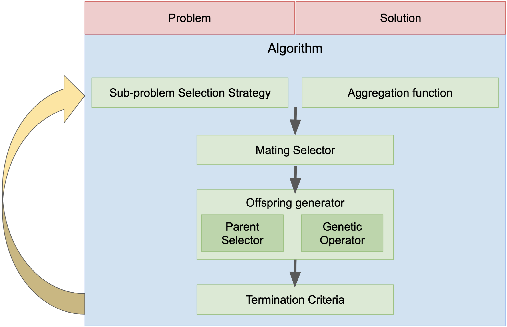

User guide
===========================================

Overview
-------------------------------------- 

moead-framework is a modular framework composed of 10 customizable components summarized in the following figure.
In this user guide, we will present the role of each component in a general way.
For more detailed information, you can visit the following documentation : https://moead-framework.github.io/framework/html/api.html

Problem & Solution
--------------------------------------

The problem is one of the main components of the framework.
The solutions are the link between the algorithm and the problem. The solutions are generated during the algorithm
in order to solve the problem.

The problem in the framework is a component that allows to randomly generate solutions and to evaluate them.
The solutions have two important attributes:
    - ``decision_vector`` : list of all decision variables of the solution
    - ``F`` : all objectives values of the solution, for example, ``F[0]`` is the objective value for the function f0 and ``F[1]`` is the objective value for the function f1.

Example of the Rmnk problem :
    >>> from moead_framework.problem.combinatorial import Rmnk
    >>>
    >>> # The file is available here : https://github.com/moead-framework/data/blob/master/problem/RMNK/Instances/rmnk_0_2_100_1_0.dat
    >>> # Others instances are available here : https://github.com/moead-framework/data/tree/master/problem/RMNK/Instances
    >>> instance_file = "rmnk_0_2_100_1_0.dat"
    >>> problem = Rmnk(instance_file=instance_file)
    >>>
    >>> # Generate a new solution
    >>> solution = problem.generate_random_solution()
    >>>
    >>> # Print all decision variables of the solution
    >>> print(solution.decision_vector)
    >>>
    >>> # Print all objectives values of the solution
    >>> print(solution.F)

Algorithm
--------------------------------------

In the framework, the algorithm is the main component, composed of several sub-components to easily parameterize it.
The algorithms are defined with default components which allows to execute them very easily with few parameters.
The mandatory parameters are the problem, the maximum number of evaluations,
the number of sub-problems in the neighborhood, the file that defines the weight vectors and the aggregation function.
The complete and detailed settings of each algorithm are available here : https://moead-framework.github.io/framework/html/main_components.html#algorithms.

Example with the original MOEA/D algorithm :
    >>> from moead_framework.aggregation import Tchebycheff
    >>> from moead_framework.algorithm.combinatorial import Moead
    >>> from moead_framework.problem.combinatorial import Rmnk
    >>>
    >>> # The file is available here : https://github.com/moead-framework/data/blob/master/problem/RMNK/Instances/rmnk_0_2_100_1_0.dat
    >>> # Others instances are available here : https://github.com/moead-framework/data/tree/master/problem/RMNK/Instances
    >>> instance_file = "moead_framework/test/data/instances/rmnk_0_2_100_1_0.dat"
    >>> rmnk = Rmnk(instance_file=instance_file)
    >>>
    >>> number_of_weight = 10
    >>> # The file is available here : https://github.com/moead-framework/data/blob/master/weights/SOBOL-2objs-10wei.ws
    >>> # Others weights files are available here : https://github.com/moead-framework/data/tree/master/weights
    >>> weight_file = "moead_framework/test/data/weights/SOBOL-" + str(rmnk.number_of_objective) + "objs-" + str(number_of_weight) + "wei.ws"
    >>>
    >>> moead = Moead(problem=rmnk,
    >>>               max_evaluation=1000,
    >>>               number_of_weight_neighborhood=2,
    >>>               weight_file=weight_file,
    >>>               aggregation_function=Tchebycheff,
    >>>               )
    >>>
    >>> population = moead.run()

Sub-problem selection strategy
--------------------------------------

This component, introduced in :cite:`moead_dra` and :cite:`gpruvost_evocop2020`, has the objective to select the sub-problems
to be optimized during the next generation. By default in MOEA/D, all subproblems are selected.
This component requires the attribute ``number_of_subproblem`` in the algorithm which defines the
number of subproblems to select.

More information : https://moead-framework.github.io/framework/html/other_components.html#sub-problem-selection-strategy

Aggregation functions
--------------------------------------

This component defines the aggregation function used to decompose the multi-objective problem into several single-objective sub-problems.
The function ``run(solution, number_of_objective, weights, sub_problem, z)`` allows to evaluate a solution for a
given sub-problem and the function ``is_better(old_value, new_value)`` allows to compare two aggregation values.

More information : https://moead-framework.github.io/framework/html/main_components.html#aggregation-functions

Mating Selector
--------------------------------------

This component aims to select the solutions that can be chosen as parent solutions to generate an offspring.
The method ``select(sub_problem)`` returns the indexes of the selected solutions.
By default in MOEA/D, this component returns the index of the solutions in the neighborhood of the subproblem
currently visited.

More information : https://moead-framework.github.io/framework/html/other_components.html#mating-selector

Offspring generator
--------------------------------------

This component is designed to generate offsprings from a set of solutions given in parameter.
Its unique method ``run(population_indexes)`` returns a unique solution.
By default, a generic component is used, it uses two subcomponents which allow to select
parent solutions (Parent Selector) and then to execute a genetic operator to generate the new offspring.

More information : https://moead-framework.github.io/framework/html/other_components.html#offspring-generator

Parent Selector
~~~~~~~~~~~~~~~~~~~~~~

This component is used in the offspring generator component.
It allows to choose the solutions which will be used to generate new solutions.
The method ``select(indexes)`` takes as parameter the indexes of the solutions available to be
selected (chosen by the Mating selector component) to return a list of solutions.

More information : https://moead-framework.github.io/framework/html/other_components.html#parent-selector

Genetic operators
~~~~~~~~~~~~~~~~~~~~~~

This component is used in the offspring generator component. This component is initialized by its constructor with
the solutions chosen by the Parent Selector component. Other parameters can be added according to the operators
like the number of crossover points or the mutation rate for example.
The ``run()`` method returns after its execution a new offspring.

More information : https://moead-framework.github.io/framework/html/other_components.html#genetic-operators

Termination criteria
--------------------------------------

This component aims at defining the stopping criteria of the algorithm. The method ``test()`` of this component
returns a boolean to define if the algorithm can continue to be executed.

More information : https://moead-framework.github.io/framework/html/other_components.html#termination-criteria
